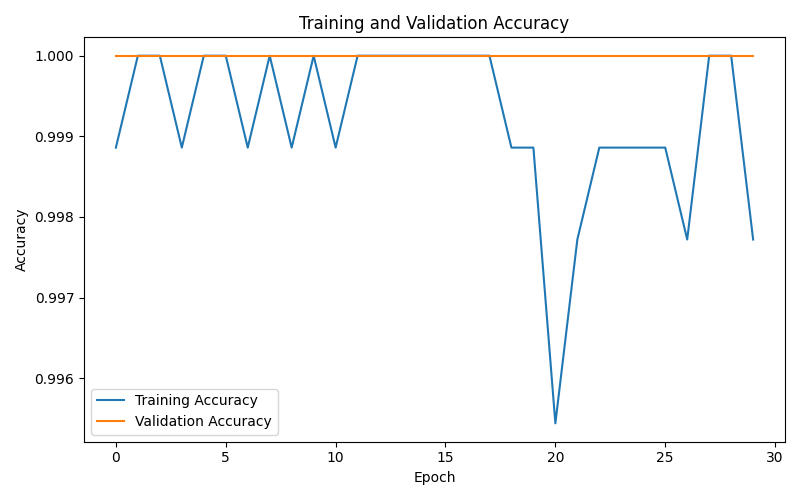
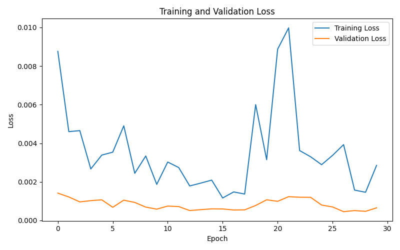
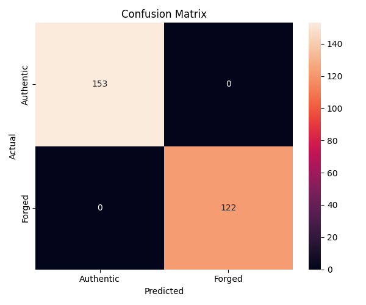
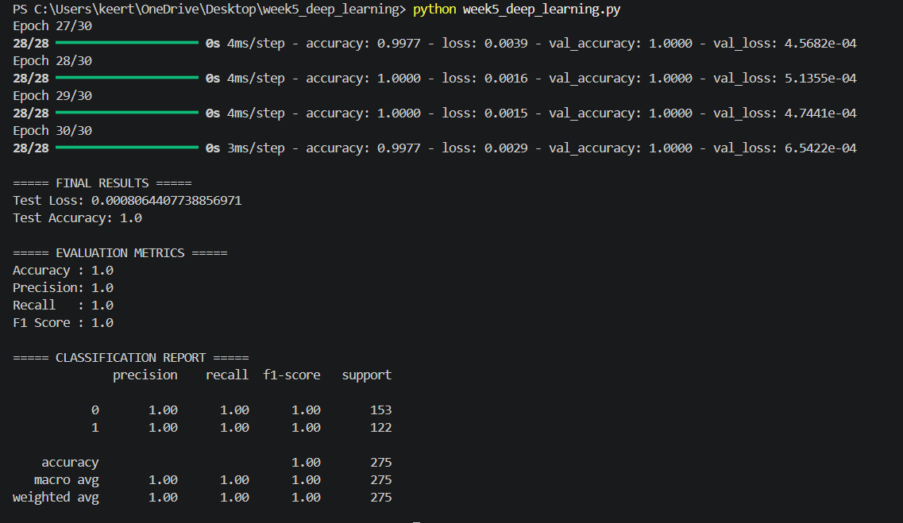

# Deep Learning Application in Data Science

## Banknote Authentication using Neural Network

This project applies a Deep Learning neural network to the Banknote Authentication dataset. The objective is to build a binary classification model that can identify whether a banknote is **Authentic** or **Forged** based on four numerical features extracted from banknote images.

## Problem Statement

Banknote authentication is an important classification problem where the characteristics of a banknote can be analyzed to determine whether it is genuine or forged.

In this project, a Neural Network is trained using four features:

- Variance
- Skewness
- Curtosis
- Entropy

The model predicts one of two classes:

- `0` – Authentic
- `1` – Forged

## Dataset

The dataset used is the **Banknote Authentication Dataset** from the UCI Machine Learning Repository.

- Total samples: **1,372**
- Input features: **4**
- Target variable: **1**
- Problem type: **Binary Classification**

The dataset was divided into:

- **80% training data**
- **20% testing data**

Feature scaling was performed using `StandardScaler` before training the neural network.

## Neural Network Architecture

The deep learning model was developed using **TensorFlow and Keras**.

```text
Input Layer
     │
     ▼
Dense Layer – 32 neurons
ReLU Activation
     │
     ▼
Dropout – 20%
     │
     ▼
Dense Layer – 16 neurons
ReLU Activation
     │
     ▼
Dense Layer – 8 neurons
ReLU Activation
     │
     ▼
Output Layer – 1 neuron
Sigmoid Activation
     │
     ▼
Authentic / Forged
```
## Training Process

The neural network was trained using the training dataset for 30 epochs with a batch size of 32. A validation split of 20% was used to monitor the model's performance during training.

## Evaluation Metrics

The model was evaluated using Accuracy, Precision, Recall, F1 Score, Classification Report, and Confusion Matrix.

## Results

The model was evaluated on 275 test samples. The confusion matrix shows that 153 Authentic banknotes and 122 Forged banknotes were correctly classified.

## Output Visualizations

### Training and Validation Accuracy

This graph shows the training and validation accuracy across the epochs.



### Training and Validation Loss

This graph shows the training and validation loss across the epochs.



### Confusion Matrix

The confusion matrix shows the actual and predicted classifications of Authentic and Forged banknotes.



## Terminal Output

The final model evaluation metrics and classification report are shown below.



## Conclusion

This project demonstrates the application of a Neural Network for binary classification using the Banknote Authentication dataset. The complete workflow includes data preprocessing, feature scaling, neural network design, training, evaluation, and visualization.

The model successfully classified the test samples, and the output visualizations provide a clear understanding of the model's training behaviour and classification results.